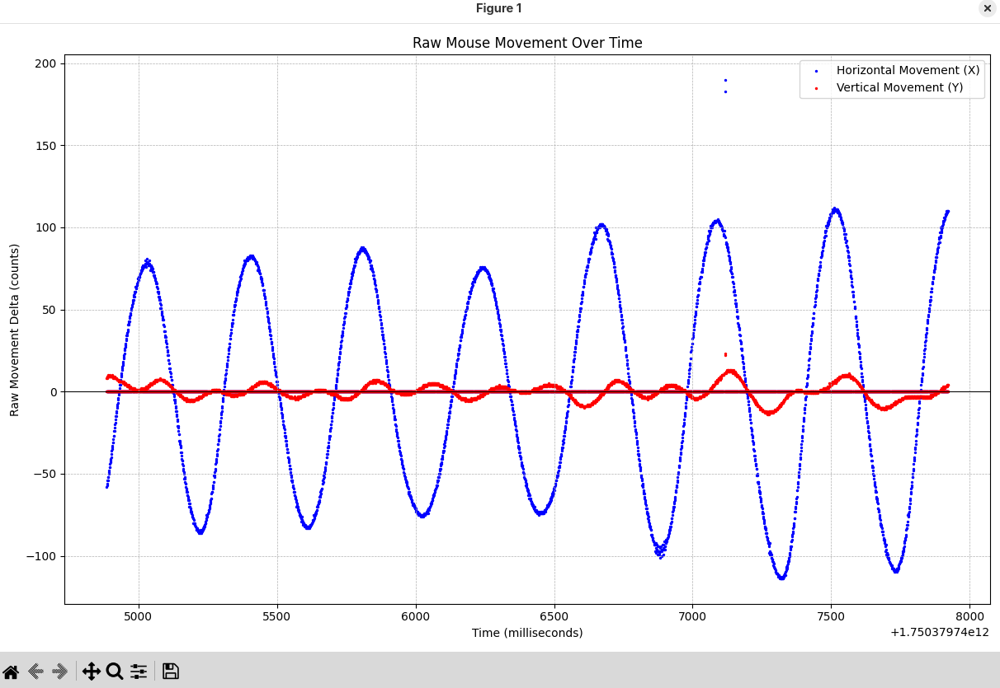

# mousetester-py

Very simple mouse testing script written in Python and inspired by [microe1/MouseTester](https://github.com/microe1/MouseTester).

Running with elevated privileges is required to access the low level raw mouse input.



```
$ python mousetester.py

Available mouse devices:
  1: Logitech Mouse (/dev/input/event3)
Please select a mouse by number: 1
Using mouse: Logitech Mouse at /dev/input/event3

Prepare to track mouse movement. Starting in...
3...
2...
1...
Start tracking!
Mouse device grabbed exclusively. Tracking has begun.
Mouse device released.
Tracking stopped.
Displaying plot. Close the plot window to exit the program.
```

# Usage

1. Create a virtual python env and activate it.
2. Install requirements from `requirements.txt`.
3. `sudo su`
4. Activate the virtual python env.
5. `python mousetester.py`
